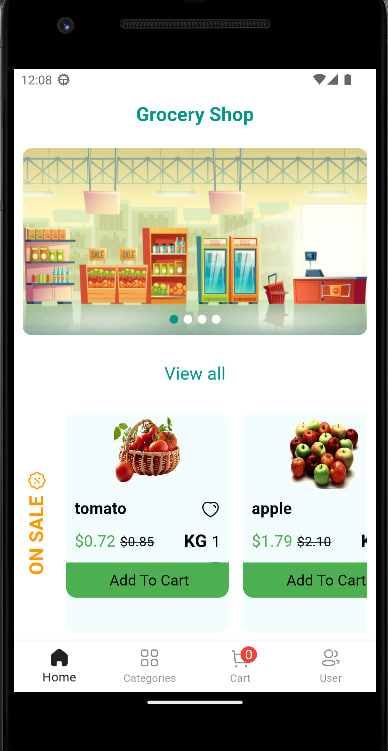
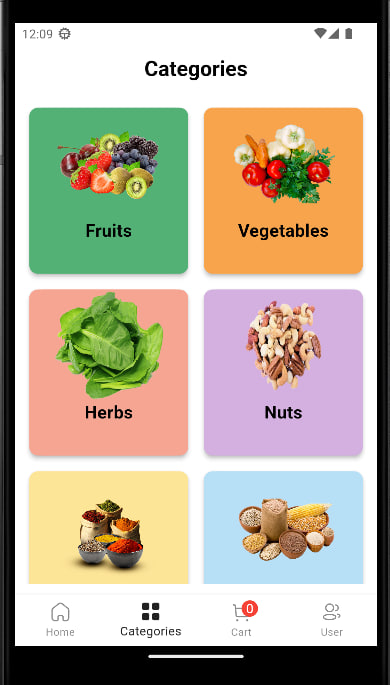
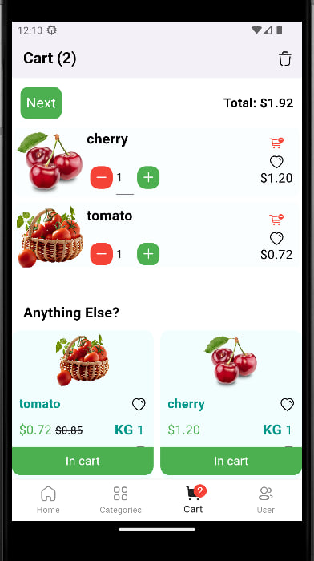
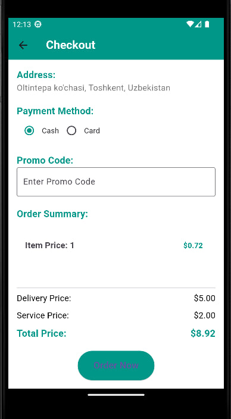
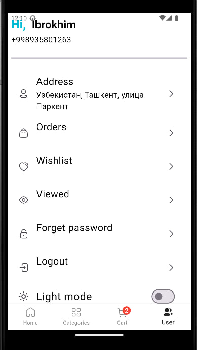

# Grocery Shop App

A Flutter-based grocery shopping application that allows users to browse products, add items to their cart, and checkout with various payment methods.

## Features

- Browse products
- Add items to cart
- Apply promo codes
- Choose from multiple payment methods
- View order summary and total price
- Save orders to Firebase Firestore

## Screenshots

### Home Screen


### Categories


### Cart Screen


### Checkout Screen


### Settings Screen


## Installation

1. Clone the repository:
    ```bash
    git clone https://github.com/<your-username>/<your-repository>.git
    ```

2. Navigate to the project directory:
    ```bash
    cd grocery_shop_app
    ```

3. Install dependencies:
    ```bash
    flutter pub get
    ```

4. Run the app:
    ```bash
    flutter run
    ```

## Configuration

To use this app, you need to set up Firebase Firestore. Follow the steps below to configure Firebase for your project:

1. Go to the [Firebase Console](https://console.firebase.google.com/).
2. Create a new project or select an existing project.
3. Add an Android app to your project.
4. Follow the instructions to download the `google-services.json` file.
5. Place the `google-services.json` file in the `android/app` directory of your Flutter project.
6. Open the `android/build.gradle` file and add the following classpath to the dependencies section:
    ```gradle
    classpath 'com.google.gms:google-services:4.3.3'
    ```

7. Open the `android/app/build.gradle` file and add the following line at the bottom of the file:
    ```gradle
    apply plugin: 'com.google.gms.google-services'
    ```

8. Set up Firestore rules in the Firebase Console to allow read and write access as needed for your app.

## Usage

1. Launch the app on your emulator or physical device.
2. Browse through the available products.
3. Add items to your cart.
4. Proceed to checkout and choose your payment method.
5. Apply a promo code if you have one.
6. Place your order.

## Contributing

Contributions are welcome! Please follow these steps to contribute:

1. Fork the repository.
2. Create a new branch:
    ```bash
    git checkout -b feature/your-feature-name
    ```

3. Make your changes and commit them:
    ```bash
    git commit -m "Add your commit message"
    ```

4. Push to the branch:
    ```bash
    git push origin feature/your-feature-name
    ```

5. Create a pull request.

## License

This project is licensed under the MIT License. See the [LICENSE](LICENSE) file for details.

## Contact

For any inquiries, please contact me at [your-email@example.com](mailto:your-email@example.com).


